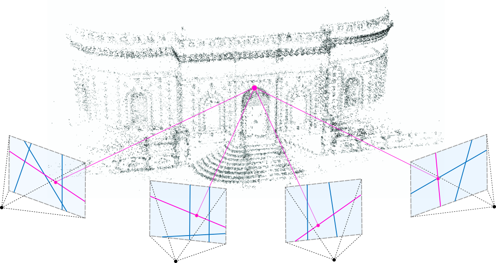

# SfM (Structure from Motion - Classical Approach)
3D scene reconstruction and camera pose estimation given images from different views (Structure from Motion)

# Topics Covered
- Feature Matching and Outlier rejection using - RANSAC
- Estimating Fundamental Matrix
- Estimating Essential Matrix from Fundamental Matrix
- Estimate Camera Pose from Essential Matrix
- Check for Cheirality Condition using - Triangulation
- Perspective-n-Point
- Bundle Adjustment
